AUTHOR: ADJEI ALEXANDER KOFI

STUDENT ID: 11187252

INTRODUCTION

The University of Ghana, Department of Computer Science welcome you. This website although an imitation of the original gives us a clear understanding of how the tools for web development is, this website has given us technical skill, opportunity and the ability to be able to create and build our own websites.

STEPS REQIURED WHEN CLONING OR SETTING-UP A PROJECT

Key focus

- Visualization: before cloning or setting-up a website, it is best that you first imagine what your website would look like. This step helps you in knowing what tools would need aside from the major tools and also gives you a clear idea of how your code should structured.
- Tools: There are lots of tool used in the creation of a website, an example of such tools are; HTML, CSS, and JAVASCRIPT. Each tool has its purpose like HTML is used for the creating the frame work of the website, after that CSS is used to style the website so that it would look more appealing. JAVASCRIPT is then used to make the website more interactive

Steps

1.  Create a file (text.txt) in your desired directory, rename the file to a name of your choice.

    Now change the extension of the file from “txt” to “html” and save

2.  Right click on the html file you just created and select the ‘open with..’ option in the drop-down menu. Select any text editor of your choice (we recommend using VS code). Or open your VS code editor and go to the file option on the top left of your screen and select open folder from the drop-down menu, VS code would open a directory for you to select a folder. From there select the folder/directory I which you created you html file.
3.  Still in VS code, go to your Explorer tab (on your left just below the file option) and select your html file. To begin our code, we must first create the basic layout/structure of an html code but don’t worry VS code has us covered so on your keyboard just press your shift key and exclamation key the enter, and there you have it the basic structure of an html code

Note: in order to create a CSS and JavaScript file just follow the steps above, the only thing that needs changing is their extensions. So for CSS the file extension is ‘css’ and for JavaScript the file extension is ‘js’

SCREENSHOTS OF MY WEBSITE

HOME

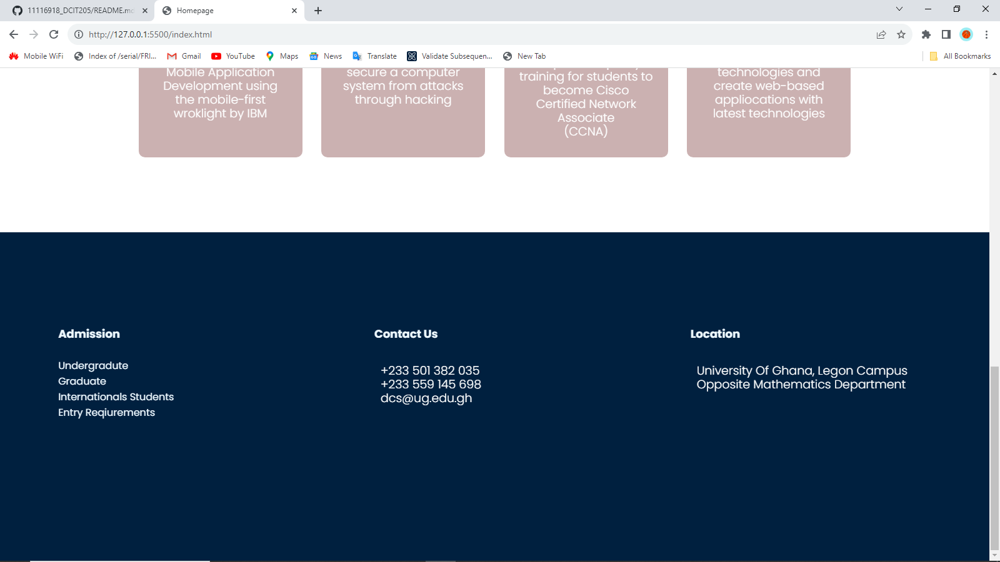

ABOUT

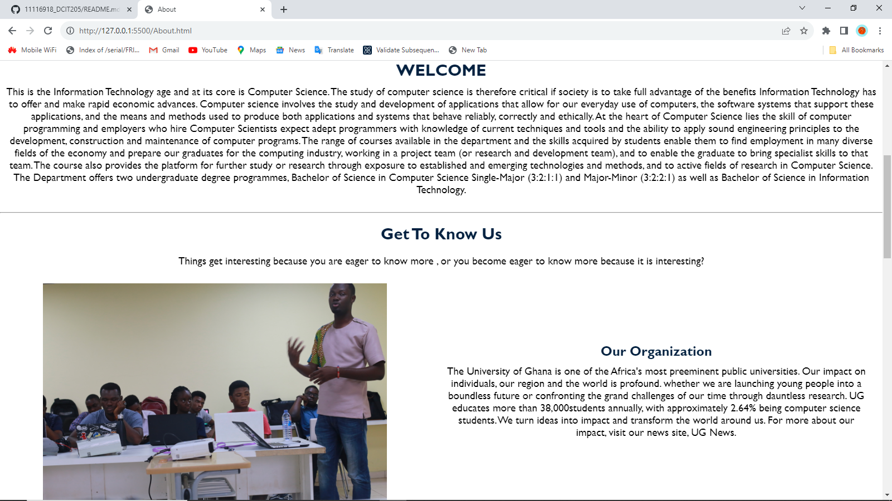

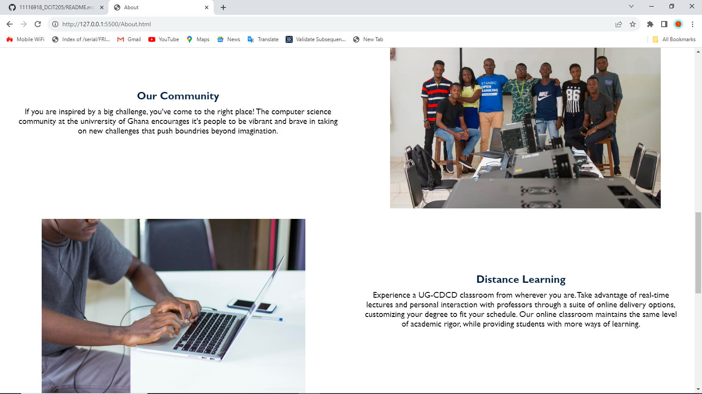

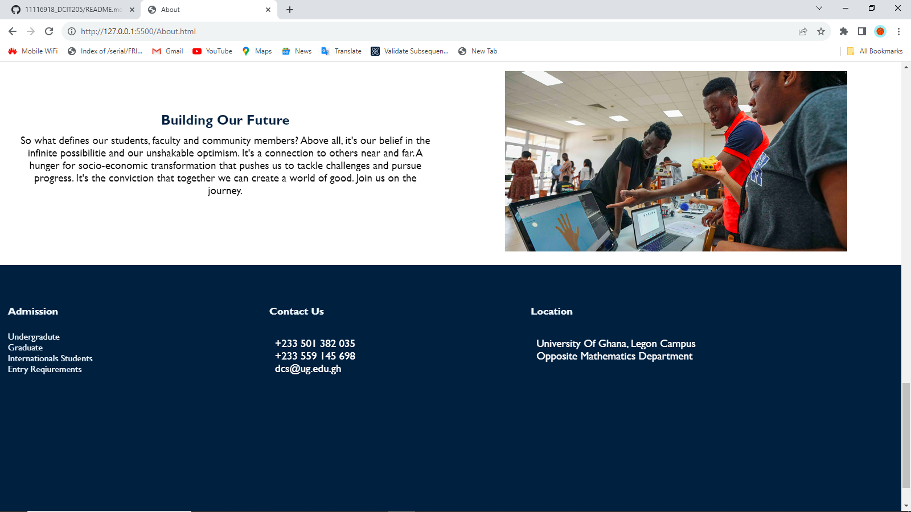

CATALOG

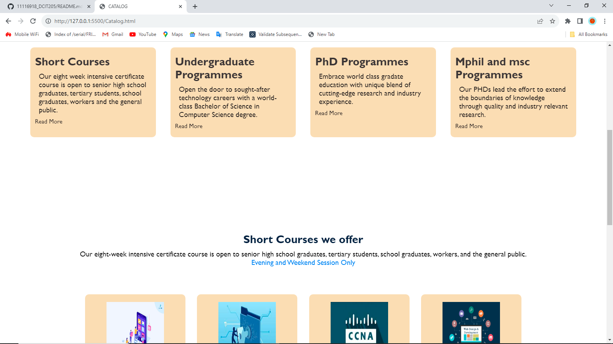

EVENTS

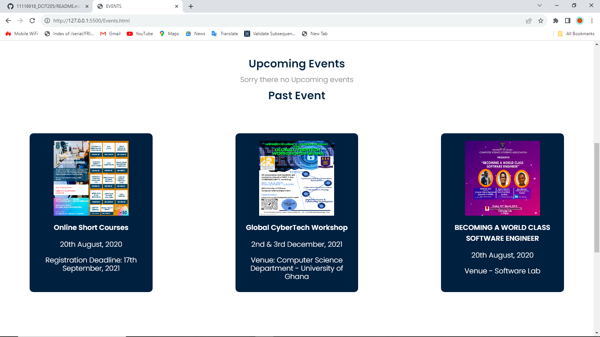

CONTACT

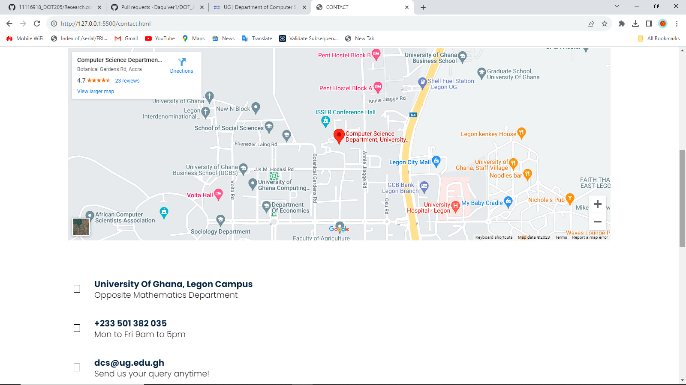

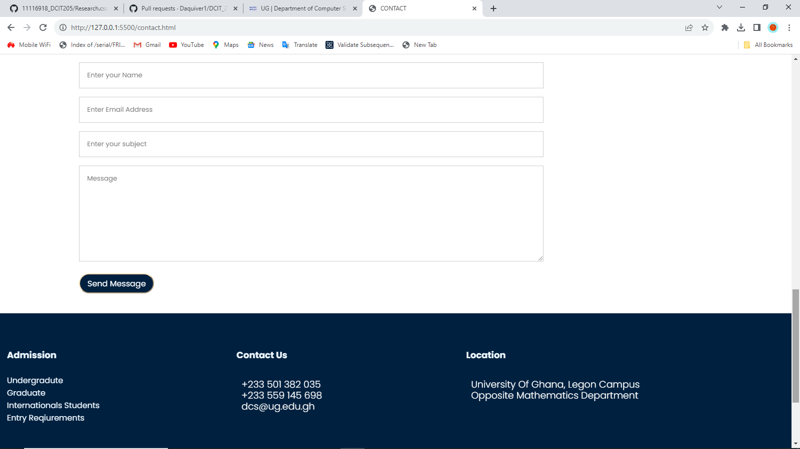

RESEARCH

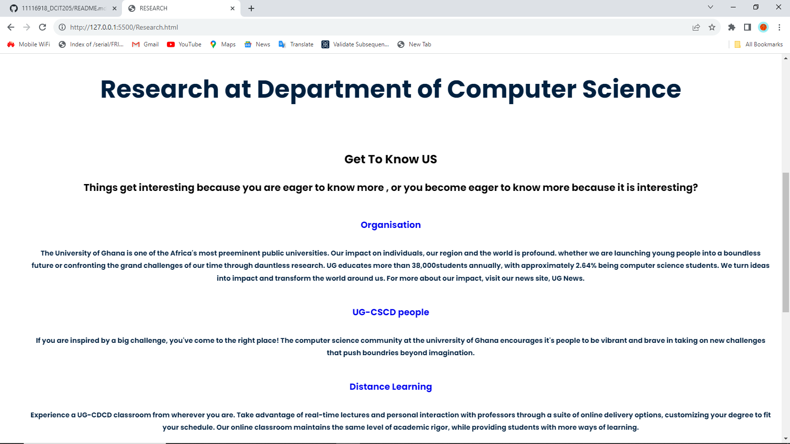

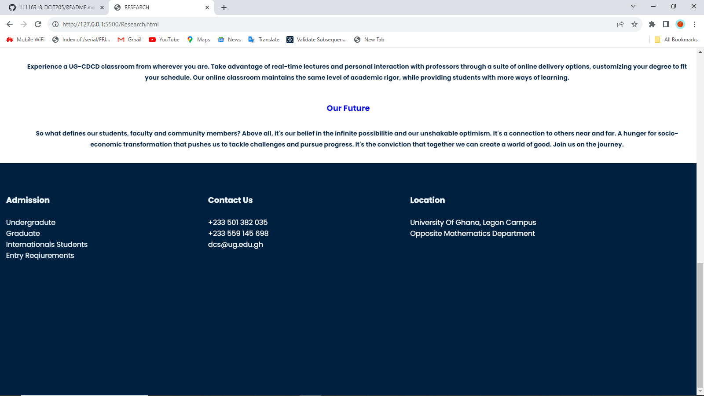

STUDENT PROJECTS

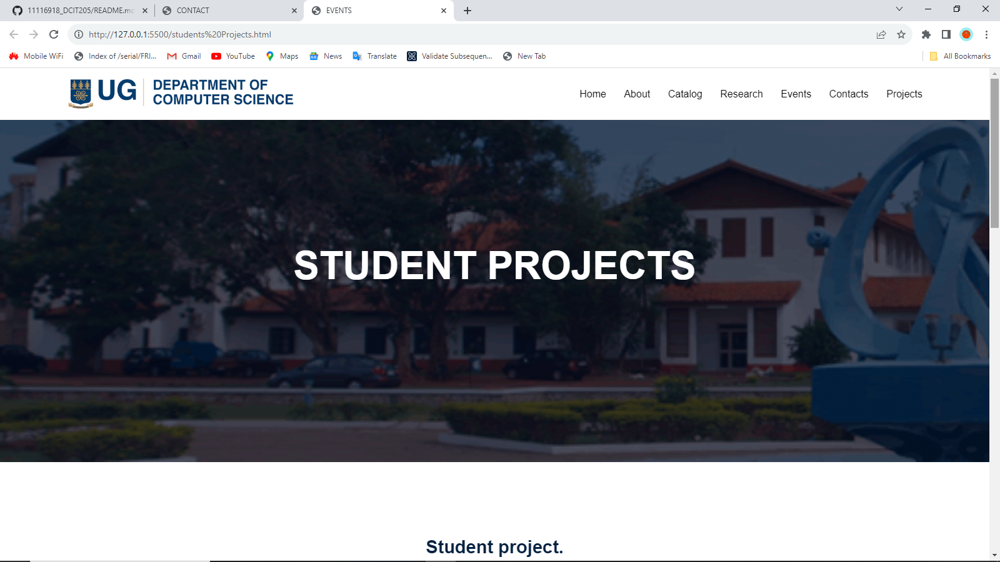

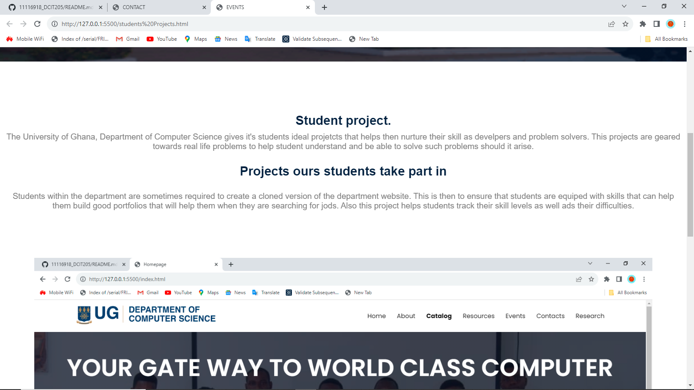

**LESSON LEARNED**

This project has taught me the necessary skill I need as a problem solver an and also to be a platform to be a great web-developer
